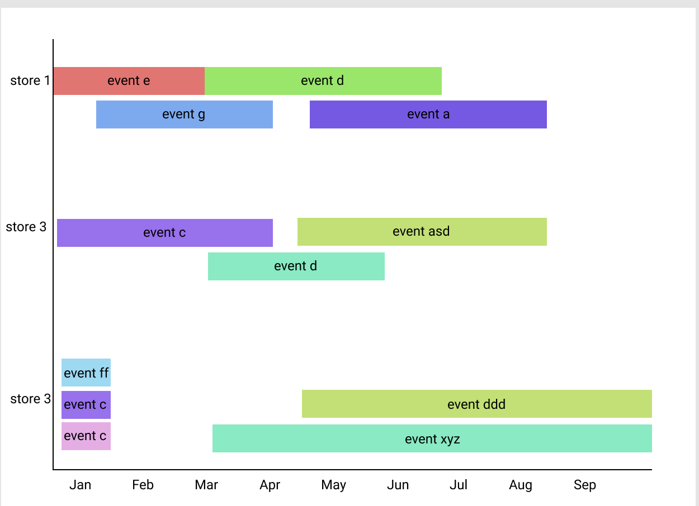

# Timeline coding challenge
> Per Diem coding challenge

### Background
1. Build a UI using well known frontend framework you're familiar with.
2. The payload is an a collection of events
3. Each event have a unique id, start_time, end time (could be null which on going), name: string and a short description.
4. Each event have store_id, you will need to group the event by a store id.
5. Some events might have no end date which mean on-going.
6. Some events might be overlapping which means that at the same time you might have more than one event.


### Requirements
- Generate the fake data using [faker.js](https://www.npmjs.com/package/faker)
- Build the UI.
- Group the event by the store_id (non unique)
- Add a tool-tip with the description.
- Show the name of the event on the square.
- Use different color for each event.

### Here's the payload
```js
{
  events: [
    { id: number, start_time: date, end_time: data / null, name: string, description: string, store_id: number },
    ...
  ]
}
```

### How it should look
